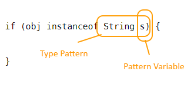

# Feature ใหม่ใน Java 17: #1 Pattern Matching for instanceof

Java 17 ถูกปล่อยออกมาอย่างเป็นทางการแล้วเมื่อวันที่ 14 กันยายน 2564
ซึ่งถ้าอยากจะดูเปรียบเทียบว่ามีอะไรต่างจาก version 11 ที่เป็น Long Term Release (LTS) ตัวก่อนหน้าก็สามารถดูได้จากที่นี่เลย
[JEPs in JDK 17 integrated since JDK 11](https://openjdk.java.net/projects/jdk/17/jeps-since-jdk-11)

สำหรับในบทความซีรี่ส์นี้เราจะมาดูในส่วนที่เป็นเฉพาะ Language Feature กันว่ามีอะไรใหม่ในตัวภาษาบ้าง ซึ่งสำหรับตอนแรกนี้ขอนำเสนอ
เรื่อง **Pattern Matching for instanceof**


## ที่มาของปัญหา
สิ่งที่ Feature นี้จะเข้ามาแก้ปัญหาหลักๆ เลยคือเรื่องความเยิ่นเย้อในการตรวจสอบ instance type<br>
ด้านล่างนี่คือ code ในการตรวจสอบ instance type และ cast ที่หลายๆ คนคงคุ้นเคยกันดี

```
if (obj instanceof Car) {
    Car c = (Car) obj;  // +_+
    c.drift();
}
```

จะเห็นได้ว่าบรรทัดที่ทำการ cast เป็นอะไรที่เยิ่นเย้อ boilerplate code มากๆ ยังไม่นับว่าทั้งหมดนี้เราต้องพิมพ์คำว่า Car ถึง 3 ครั้ง!

## Pattern Matching for instanceof
ด้วย feature นี้ของ Java 17[^1] code เราจะกระชับขึ้น กลายเป็น
```
if (obj instanceof Car c) {
    c.drift();
}
```
อาจจะไม่ได้เป็น feature ที่เปลี่ยนแปลงอะไรมากนัก แต่ก็ช่วยทำให้ code ของเรากระชับขึ้นและมีโอกาสมีข้อผิดพลาดได้น้อยลง

## ข้อควรระวัง
จุดที่น่าสนใจจุดหนึ่งของ feature นี้ก็คือ scope ของตัว pattern variable



pattern variable ใช้ concept ที่เรียกว่า flow scoping ซึ่งหมายความว่า pattern variable จะอยู่ใน scope เฉพาะในจุดที่ compiler สามารถบอกได้ว่า pattern นี้ match

ถ้าจากตัวอย่างด้านบนก็หมายความว่า เราจะเรียกใช้ตัวแปร c ได้ก็ต่อเมื่อมันถูกเรียกใช้ในจุดที่ compiler มั่นใจว่า c คือ Car เท่านั้น
```
if (obj instanceof Car c) {
    c.drift(); // เรียกใช้ c ตรงนี้ได้
}
c.drift(); // compile error เรียกใช้ c ตรงนี้ไม่ได้
```
หรือถ้าเราเขียนอีกแบบ
```
if (!(obj instanceof Car c)) {
    c.drift(); // เรียกใช้ c ตรงนี้ไม่ได้ เพราะถ้าเข้า block นี้แปลว่า c ไม่ใช่ Car
    throw new RuntimeException();
}
c.drift(); // เรียกใช้ c ตรงนี้ได้! เพราะ compiler มั่นใจว่า ณ บรรทัดนี้ c คือ Car
```
ซึ่งถ้าเราใช้ boolean operator ควบคู่ไปกับ instanceof ด้วยก็ยังใช้หลักการเดียวกัน

```
if (obj instanceof String s && s.length() > 0) {
    // แบบนี้สามารถทำได้ เพราะด้านหลัง operator && s เป็น String แน่ๆ
}

if (obj instanceof String s || s.length() > 0) {
    // แต่แบบนี้จะ compile error เพราะหลัง operator || s อาจจะไม่ใช่ String ก็ได้ 
}
```
## สรุป
Java 17 เพิ่ม Feature `Pattern Matching for instanceof` เข้ามาเพื่อให้การเขียน check + cast type กระชับขึ้น
โดยที่มีข้อควรระวังเรื่อง Scope ของ pattern variable อยู่เล็กน้อย<br>
หลักการในการจำง่ายๆ ก็คือ **pattern variable จะอยู่ใน scope เฉพาะในจุดที่มัน match เท่านั้น** ครับ

[^1]: อันที่จริง feature นี้เพิ่มเข้ามาตั้งแต่ Java 16
