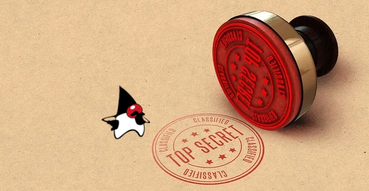
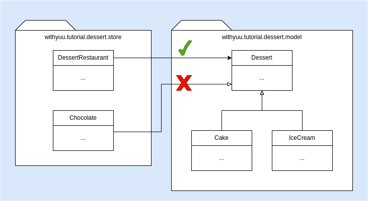

# Feature ใหม่ใน Java 17: #4 Sealed Classes



Sealed Class หรือ Sealed Interface ช่วยให้เราระบุได้ว่า class ไหนที่จะมา extend/implement class 
หรือ interface ของเราได้

```java
public sealed abstract class Pet permits Cat, Dog, Bird { ... }

public final class Cat extends Pet { ... }
public final class Dog extends Pet { ... }
public final class Bird extends Pet { ... }
```

### ที่มาของปัญหา
ที่มาของ sealed class คือเรา**ต้องการสร้าง superclass ที่ใครๆ ก็สามารถเข้าถึงได้แต่ไม่สามารถ extend ได้** เช่น



จาก class diagram ด้านบน เราอยากให้ DessertRestaurant สามารถ access Dessert ซึ่งเป็น superclass ของ Cake และ IceCream ได้
แต่ไม่อยากให้ Chocolate มา extend Dessert ได้

ก่อนหน้า Java 17 ถ้าเราอยากไม่อยากให้ class จาก package อื่นมา extend Dessert เราจะประกาศให้ Dessert เป็น
package-private ตามโค้ดด้านล่าง
```java
abstract class Dessert { ... }

public final class Cake extends Dessert { ... }
public final class IceCream extends Dessert { ... }
```
วิธีนี้กัน class อื่นมา extend ได้จริงแต่ปัญหาคือเราจะไม่สามารถใช้งาน Dessert จาก package อื่นได้ (extend ไม่ได้ และ access ไม่ได้)
```java
// Compile Error
// Cannot access Dessert from outside package
Dessert dessert = new Cake();
```
และถ้าเราจะแก้ให้ Dessert สามารถเข้าถึงได้โดยการเปลี่ยน access เป็น public ก็จะกลายเป็นว่า class อื่นๆ สามารถ extend Dessert ของเราได้อีก
(extend ได้ และ access ได้)

จะเห็นได้ว่าการ extend และ access มาพร้อมๆ กันเสมอ Sealed Class จึงเกิดมาเพื่อแก้ปัญหานี้

_Challenge for Java Geek: อันที่จริงเราพอมีหนทางแก้ปัญหานี้โดยไม่ใช้ Sealed Class อยู่นะครับ ลองคิดเล่นๆ ดูก่อน
เดี๋ยวจะเฉลยด้านล่าง :)_

## การใช้งาน Sealed Class
```java
public sealed abstract class Pet permits Cat, Dog, Bird { ... }

public final class Cat extends Pet { ... }

public sealed class Dog extends Pet {
  public static final class Hound extends Dog {}
  public static final class Terrier extends Dog {}
}

public non-sealed class Bird extends Pet { ... }
```
- ประกาศให้เป็น Sealed Class / Sealed Interface ด้วย keyword `sealed`
- Sealed Class ต้องประกาศ class ที่อนุญาตให้ extend ได้หลัง keyword `permits`
  - ในกรณีที่ permitted subclass อยู่ใน source file เดียวกันทั้งหมด ไม่ต้องใช้ `permits` ก็ได้ เช่น class Dog ในตัวอย่างด้านบน
- Sealed Class กับ permitted subclass ต้องอยู่ package เดียวกัน หรือ module เดียวกัน
- Subclass ของ Sealed Class จะต้องประกาศเป็น 1 ใน 3 แบบนี้
  - `final class`
  - `sealed class`
  - `non-seal class`
    - class ที่ประกาศเป็น `non-seal` จะสามารถ extend โดย class อื่นได้ 
    - `non-seal` เป็น keyword แรกใน Java ที่มี dash !!
- ใช้ [Record](record.md) เป็น subclass ได้ (Record เป็น final class by default)

## สรุป
Sealed Class/Interface เหมาะกับการนำไปใช้ทำ library มาก เพราะเข้ามาช่วยจำกัด subclass ให้อยู่ในขอบเขตที่เราต้องการ
โดยที่ library user ยังสามารถเรียกใช้ superclass ได้เหมือนเดิม

สามารถดู source code ในบทความนี้ได้ [ที่นี่](https://github.com/withyuu/java-11-to-17)

## เฉลย Challenge for Java Geek
ก่อนหน้า Java 17 เราก็พอจะทำให้ class อื่น access superclass โดยที่ไม่สามารถ extend ได้ ด้วยการใช้ non-public constructor
```java
public abstract class Dessert {
  // package-private constructor
  Dessert() {}
}
public final class Cake extends Dessert { ... }
public final class IceCream extends Dessert { ... }
```
อย่างไรก็ตาม วิธีนี้ใช้กับ interface ไม่ได้อยู่ดีครับ